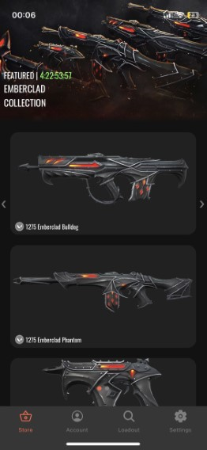
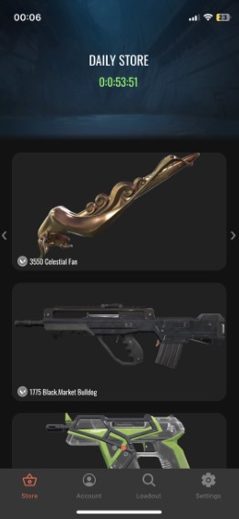
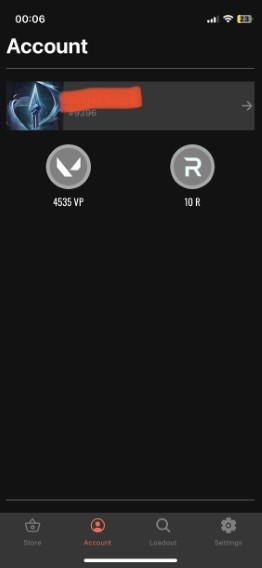
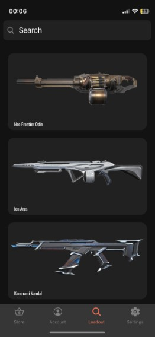

# ValStoreTracker
 
# Overview

ValStoreTracker is an app that enables you to view the Valorant in-game store from your iPhone and more. This is easier than having to start the game client every day just to check if your favourite skin is available.

#### What is Valorant?
Valorant is a tactical first-person shooter developed by Riot Games, featuring team-based gameplay.

#### What is the Valorant Store?
The Valorant skin store is an in-game marketplace where players can purchase cosmetic items such as weapon skins and other customization options. Each player has a unique shop that rotates daily.

# App Store

I won't be uploading the app to the appstore for the following reasons:
- I have made this app mainly for personal use
- I have made this app to learn about app/web development
- There are other store trackers out there ( if not taken down by Riot Games)
- It violates Riot's Policy

# Features
- Login/Logout
- View current skin bundle
- View featured skins
- View wallet
- View owned skins
- Dark/Light Theme switch

# Tools

Tools that I have used to make this project:

- Javascript
- CSS
- React-Native
- Expo Go
- Jetbrains Webstorm

# Run the project
### Install the dependencies

```
$ npm install
```

### Start the Expo Server
##### local
```
$ npx expo start
```
#### tunnel
```
$ npx expo start --tunnel
```

#### Open the App

Downloading Expo Go from the App Store and
scan the QR code.

# Screenshots






